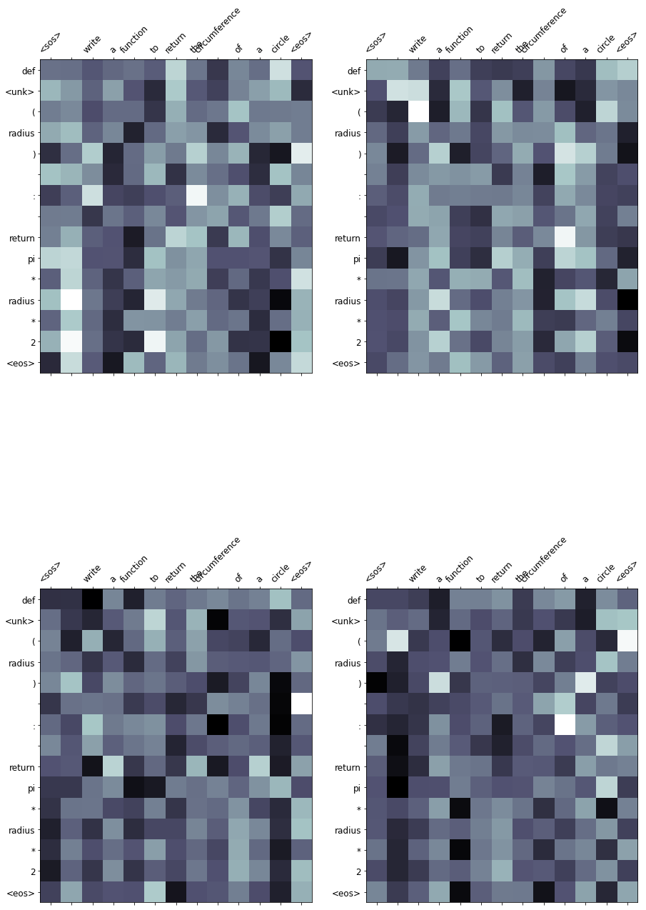

# English to Python Translation using Transformers.

The idea of the project is to generate python programs from the short description written in English about the particular python program. Tranformers are a very capable architecture that can be used for NLP tasks. Please refer https://medium.com/analytics-vidhya/a-deep-dive-into-transformers-cdad59bf4260 to know more about Transformers.

# Data

Data is stored in a .py containing the Short Description of the python code commented and the corresponding python code.

## 1. Seperating Short Description from Code.

First step is to seprate the short description from the python code. For that we have manually introduced "\n\n\n#" as an identifier to the start of the Short Description. The nextline from this short description will be counted as python code. This is done intentionally to not take comments in the python code for the short description.

### Sample short description
```
fibonacci series up to 100
```

### Sample python code
```
n   =   100 
result   =    [   ] 
a ,   b   =   0   ,   1 
while b   <   n : 
result . append (   b ) 
a ,   b   =   b ,   a   +   b 
final   =   result 
print ( f"Fibonacci series up to 100 :   { final } " )
```

## 2. Reducing the token counts

When we apply tokenizer on this datset we get around 14000 unique tokens approximately for the dataset. Which is unlikely and the reason for this number is because of the inconsistancy with the syntax i.e. "print(", "print( ", "print (" will be taken as 3 different token. This is just an example there as lot of such issues with the dataset which we have cleaned manually as per the pointers followed

```
  code = code.replace("(", " ( ")
  code = code.replace("[", " [ ")
  code = code.replace(":", " : ")
  code = code.replace(")", " ) ")
  code = code.replace(",", " , ")
  code = code.replace("]", " ] ")
  code = code.replace("}", " } ")
  code = code.replace("{", " { ")
  code = code.replace("=", " = ")
  code = code.replace("=  =", "==")
  code = code.replace("> =", ">=")
  code = code.replace("< =", "<=")
  code = code.replace("! =", "!=")
  code = code.replace("+ =", "+=")
  code = code.replace("- =", "-=")
  code = code.replace("* =", "*=")
  code = code.replace("/ =", "/=")
  code = code.replace("& =", "&=")
  # <
  code = code.replace("<", " < ")
  code = code.replace("< <", "<<")
  code = code.replace("< =", "<=")
  code = code.replace("< -", "<-")
  # -
  code = code.replace("-", " - ")
  code = code.replace("- =", "-=")
  code = code.replace("< -", "<-")
  # >
  code = code.replace(">", " > ")
  code = code.replace("> >", ">>")
  code = code.replace("> =", ">=")
  # !
  code = code.replace("!", " ! ")
  code = code.replace("! =", "!=")
  # +
  code = code.replace("+", " + ")
  code = code.replace("+ =", "+=")
  # *
  code = code.replace("*", " * ")
  code = code.replace("* *", "**")
  code = code.replace("* =", "*=")
  # /
  code = code.replace("/", " / ")
  code = code.replace("/ /", "//")
  code = code.replace("/ =", "/=")
  # &
  code = code.replace("&", " & ")
  code = code.replace("& =", "&=")
  code = code.replace("& &", "&&")
  # ~
  code = code.replace("~", " ~ ")
```

This process has hugely reduced our token count from 15k to 5k approximately.

## 3. Generate samples

Once the cleaning process completed, we generate training, test, validation samples.

A Sample Observation,

`
{'src': [' ',
  'calculate',
  'memory',
  'is',
  'being',
  'used',
  'by',
  'an',
  'list',
  'in',
  'python'],
 'trg': ['import',
  'sys',
  '\n',
  'list1',
  ' ',
  '=',
  '  ',
  '[',
  "'",
  'Scott',
  "'",
  ',',
  ' ',
  "'",
  'Eric',
  "'",
  ',',
  ' ',
  "'",
  'Kelly',
  "'",
  ',',
  ' ',
  "'",
  'Emma',
  "'",
  ',',
  ' ',
  "'",
  'Smith',
  "'",
  ']',
  '\n',
  'print',
  '(',
  '"',
  'size',
  'of',
  'list',
  ' ',
  '=',
  ' ',
  '"',
  ',',
  'sys.getsizeof',
  '(',
  'list1',
  ')',
  ' ',
  ')']}
`

The tokens are looking good now let us start model building


# Model

Here are we are using the Transformer model as mentioned earlier.

```
Seq2Seq(
  (encoder): Encoder(
    (tok_embedding): Embedding(1571, 512)
    (pos_embedding): Embedding(256, 512)
    (layers): ModuleList(
      (0): EncoderLayer(
        (self_attn_layer_norm): LayerNorm((512,), eps=1e-05, elementwise_affine=True)
        (ff_layer_norm): LayerNorm((512,), eps=1e-05, elementwise_affine=True)
        (self_attention): MultiHeadAttentionLayer(
          (fc_q): Linear(in_features=512, out_features=512, bias=True)
          (fc_k): Linear(in_features=512, out_features=512, bias=True)
          (fc_v): Linear(in_features=512, out_features=512, bias=True)
          (fc_o): Linear(in_features=512, out_features=512, bias=True)
          (dropout): Dropout(p=0.2, inplace=False)
        )
        (positionwise_feedforward): PositionwiseFeedforwardLayer(
          (fc_1): Linear(in_features=512, out_features=1024, bias=True)
          (fc_2): Linear(in_features=1024, out_features=512, bias=True)
          (dropout): Dropout(p=0.2, inplace=False)
        )
        (dropout): Dropout(p=0.2, inplace=False)
      )
      (1): EncoderLayer(
        (self_attn_layer_norm): LayerNorm((512,), eps=1e-05, elementwise_affine=True)
        (ff_layer_norm): LayerNorm((512,), eps=1e-05, elementwise_affine=True)
        (self_attention): MultiHeadAttentionLayer(
          (fc_q): Linear(in_features=512, out_features=512, bias=True)
          (fc_k): Linear(in_features=512, out_features=512, bias=True)
          (fc_v): Linear(in_features=512, out_features=512, bias=True)
          (fc_o): Linear(in_features=512, out_features=512, bias=True)
          (dropout): Dropout(p=0.2, inplace=False)
        )
        (positionwise_feedforward): PositionwiseFeedforwardLayer(
          (fc_1): Linear(in_features=512, out_features=1024, bias=True)
          (fc_2): Linear(in_features=1024, out_features=512, bias=True)
          (dropout): Dropout(p=0.2, inplace=False)
        )
        (dropout): Dropout(p=0.2, inplace=False)
      )
      (2): EncoderLayer(
        (self_attn_layer_norm): LayerNorm((512,), eps=1e-05, elementwise_affine=True)
        (ff_layer_norm): LayerNorm((512,), eps=1e-05, elementwise_affine=True)
        (self_attention): MultiHeadAttentionLayer(
          (fc_q): Linear(in_features=512, out_features=512, bias=True)
          (fc_k): Linear(in_features=512, out_features=512, bias=True)
          (fc_v): Linear(in_features=512, out_features=512, bias=True)
          (fc_o): Linear(in_features=512, out_features=512, bias=True)
          (dropout): Dropout(p=0.2, inplace=False)
        )
        (positionwise_feedforward): PositionwiseFeedforwardLayer(
          (fc_1): Linear(in_features=512, out_features=1024, bias=True)
          (fc_2): Linear(in_features=1024, out_features=512, bias=True)
          (dropout): Dropout(p=0.2, inplace=False)
        )
        (dropout): Dropout(p=0.2, inplace=False)
      )
    )
    (dropout): Dropout(p=0.2, inplace=False)
  )
  (decoder): Decoder(
    (tok_embedding): Embedding(4699, 512)
    (pos_embedding): Embedding(256, 512)
    (layers): ModuleList(
      (0): DecoderLayer(
        (self_attn_layer_norm): LayerNorm((512,), eps=1e-05, elementwise_affine=True)
        (enc_attn_layer_norm): LayerNorm((512,), eps=1e-05, elementwise_affine=True)
        (ff_layer_norm): LayerNorm((512,), eps=1e-05, elementwise_affine=True)
        (self_attention): MultiHeadAttentionLayer(
          (fc_q): Linear(in_features=512, out_features=512, bias=True)
          (fc_k): Linear(in_features=512, out_features=512, bias=True)
          (fc_v): Linear(in_features=512, out_features=512, bias=True)
          (fc_o): Linear(in_features=512, out_features=512, bias=True)
          (dropout): Dropout(p=0.2, inplace=False)
        )
        (encoder_attention): MultiHeadAttentionLayer(
          (fc_q): Linear(in_features=512, out_features=512, bias=True)
          (fc_k): Linear(in_features=512, out_features=512, bias=True)
          (fc_v): Linear(in_features=512, out_features=512, bias=True)
          (fc_o): Linear(in_features=512, out_features=512, bias=True)
          (dropout): Dropout(p=0.2, inplace=False)
        )
        (positionwise_feedforward): PositionwiseFeedforwardLayer(
          (fc_1): Linear(in_features=512, out_features=1024, bias=True)
          (fc_2): Linear(in_features=1024, out_features=512, bias=True)
          (dropout): Dropout(p=0.2, inplace=False)
        )
        (dropout): Dropout(p=0.2, inplace=False)
      )
      (1): DecoderLayer(
        (self_attn_layer_norm): LayerNorm((512,), eps=1e-05, elementwise_affine=True)
        (enc_attn_layer_norm): LayerNorm((512,), eps=1e-05, elementwise_affine=True)
        (ff_layer_norm): LayerNorm((512,), eps=1e-05, elementwise_affine=True)
        (self_attention): MultiHeadAttentionLayer(
          (fc_q): Linear(in_features=512, out_features=512, bias=True)
          (fc_k): Linear(in_features=512, out_features=512, bias=True)
          (fc_v): Linear(in_features=512, out_features=512, bias=True)
          (fc_o): Linear(in_features=512, out_features=512, bias=True)
          (dropout): Dropout(p=0.2, inplace=False)
        )
        (encoder_attention): MultiHeadAttentionLayer(
          (fc_q): Linear(in_features=512, out_features=512, bias=True)
          (fc_k): Linear(in_features=512, out_features=512, bias=True)
          (fc_v): Linear(in_features=512, out_features=512, bias=True)
          (fc_o): Linear(in_features=512, out_features=512, bias=True)
          (dropout): Dropout(p=0.2, inplace=False)
        )
        (positionwise_feedforward): PositionwiseFeedforwardLayer(
          (fc_1): Linear(in_features=512, out_features=1024, bias=True)
          (fc_2): Linear(in_features=1024, out_features=512, bias=True)
          (dropout): Dropout(p=0.2, inplace=False)
        )
        (dropout): Dropout(p=0.2, inplace=False)
      )
      (2): DecoderLayer(
        (self_attn_layer_norm): LayerNorm((512,), eps=1e-05, elementwise_affine=True)
        (enc_attn_layer_norm): LayerNorm((512,), eps=1e-05, elementwise_affine=True)
        (ff_layer_norm): LayerNorm((512,), eps=1e-05, elementwise_affine=True)
        (self_attention): MultiHeadAttentionLayer(
          (fc_q): Linear(in_features=512, out_features=512, bias=True)
          (fc_k): Linear(in_features=512, out_features=512, bias=True)
          (fc_v): Linear(in_features=512, out_features=512, bias=True)
          (fc_o): Linear(in_features=512, out_features=512, bias=True)
          (dropout): Dropout(p=0.2, inplace=False)
        )
        (encoder_attention): MultiHeadAttentionLayer(
          (fc_q): Linear(in_features=512, out_features=512, bias=True)
          (fc_k): Linear(in_features=512, out_features=512, bias=True)
          (fc_v): Linear(in_features=512, out_features=512, bias=True)
          (fc_o): Linear(in_features=512, out_features=512, bias=True)
          (dropout): Dropout(p=0.2, inplace=False)
        )
        (positionwise_feedforward): PositionwiseFeedforwardLayer(
          (fc_1): Linear(in_features=512, out_features=1024, bias=True)
          (fc_2): Linear(in_features=1024, out_features=512, bias=True)
          (dropout): Dropout(p=0.2, inplace=False)
        )
        (dropout): Dropout(p=0.2, inplace=False)
      )
    )
    (fc_out): Linear(in_features=512, out_features=4699, bias=True)
    (dropout): Dropout(p=0.2, inplace=False)
  )
)
```

# Loss Function

We are using CrossEntropy loss as loss function and PPL as the evaluation metrics. Please look into the training logs trained for 50 epochs below,

```
Epoch: 01 | Time: 0m 15s
	Train Loss: 0.024 | Train PPL:   1.024
	 Val. Loss: 0.085 |  Val. PPL:   1.089
Epoch: 02 | Time: 0m 16s
	Train Loss: 0.017 | Train PPL:   1.017
	 Val. Loss: 0.069 |  Val. PPL:   1.071
Epoch: 03 | Time: 0m 15s
	Train Loss: 0.013 | Train PPL:   1.013
	 Val. Loss: 0.055 |  Val. PPL:   1.057
Epoch: 04 | Time: 0m 15s
	Train Loss: 0.012 | Train PPL:   1.012
	 Val. Loss: 0.046 |  Val. PPL:   1.047
Epoch: 05 | Time: 0m 15s
	Train Loss: 0.011 | Train PPL:   1.011
	 Val. Loss: 0.039 |  Val. PPL:   1.040
Epoch: 06 | Time: 0m 15s
	Train Loss: 0.010 | Train PPL:   1.010
	 Val. Loss: 0.034 |  Val. PPL:   1.035
Epoch: 07 | Time: 0m 15s
	Train Loss: 0.009 | Train PPL:   1.009
	 Val. Loss: 0.033 |  Val. PPL:   1.033
Epoch: 08 | Time: 0m 16s
	Train Loss: 0.008 | Train PPL:   1.008
	 Val. Loss: 0.029 |  Val. PPL:   1.029
Epoch: 09 | Time: 0m 15s
	Train Loss: 0.008 | Train PPL:   1.008
	 Val. Loss: 0.028 |  Val. PPL:   1.028
Epoch: 10 | Time: 0m 15s
	Train Loss: 0.007 | Train PPL:   1.007
	 Val. Loss: 0.028 |  Val. PPL:   1.029
Epoch: 11 | Time: 0m 15s
	Train Loss: 0.006 | Train PPL:   1.007
	 Val. Loss: 0.020 |  Val. PPL:   1.020
Epoch: 12 | Time: 0m 15s
	Train Loss: 0.006 | Train PPL:   1.006
	 Val. Loss: 0.022 |  Val. PPL:   1.022
Epoch: 13 | Time: 0m 15s
	Train Loss: 0.006 | Train PPL:   1.006
	 Val. Loss: 0.019 |  Val. PPL:   1.020
Epoch: 14 | Time: 0m 16s
	Train Loss: 0.005 | Train PPL:   1.005
	 Val. Loss: 0.018 |  Val. PPL:   1.018
Epoch: 15 | Time: 0m 15s
	Train Loss: 0.005 | Train PPL:   1.005
	 Val. Loss: 0.020 |  Val. PPL:   1.021
Epoch: 16 | Time: 0m 15s
	Train Loss: 0.005 | Train PPL:   1.005
	 Val. Loss: 0.020 |  Val. PPL:   1.020
Epoch: 17 | Time: 0m 15s
	Train Loss: 0.004 | Train PPL:   1.004
	 Val. Loss: 0.016 |  Val. PPL:   1.016
Epoch: 18 | Time: 0m 15s
	Train Loss: 0.004 | Train PPL:   1.004
	 Val. Loss: 0.015 |  Val. PPL:   1.015
Epoch: 19 | Time: 0m 16s
	Train Loss: 0.004 | Train PPL:   1.004
	 Val. Loss: 0.012 |  Val. PPL:   1.012
Epoch: 20 | Time: 0m 15s
	Train Loss: 0.004 | Train PPL:   1.004
	 Val. Loss: 0.011 |  Val. PPL:   1.011
Epoch: 21 | Time: 0m 15s
	Train Loss: 0.004 | Train PPL:   1.004
	 Val. Loss: 0.011 |  Val. PPL:   1.011
Epoch: 22 | Time: 0m 15s
	Train Loss: 0.003 | Train PPL:   1.003
	 Val. Loss: 0.010 |  Val. PPL:   1.010
Epoch: 23 | Time: 0m 15s
	Train Loss: 0.003 | Train PPL:   1.003
	 Val. Loss: 0.012 |  Val. PPL:   1.012
Epoch: 24 | Time: 0m 15s
	Train Loss: 0.003 | Train PPL:   1.003
	 Val. Loss: 0.015 |  Val. PPL:   1.015
Epoch: 25 | Time: 0m 15s
	Train Loss: 0.003 | Train PPL:   1.003
	 Val. Loss: 0.010 |  Val. PPL:   1.010
Epoch: 26 | Time: 0m 15s
	Train Loss: 0.003 | Train PPL:   1.003
	 Val. Loss: 0.010 |  Val. PPL:   1.010
Epoch: 27 | Time: 0m 15s
	Train Loss: 0.003 | Train PPL:   1.003
	 Val. Loss: 0.011 |  Val. PPL:   1.011
Epoch: 28 | Time: 0m 15s
	Train Loss: 0.003 | Train PPL:   1.003
	 Val. Loss: 0.010 |  Val. PPL:   1.010
Epoch: 29 | Time: 0m 15s
	Train Loss: 0.002 | Train PPL:   1.002
	 Val. Loss: 0.010 |  Val. PPL:   1.010
Epoch: 30 | Time: 0m 15s
	Train Loss: 0.002 | Train PPL:   1.002
	 Val. Loss: 0.008 |  Val. PPL:   1.008
Epoch: 31 | Time: 0m 15s
	Train Loss: 0.002 | Train PPL:   1.002
	 Val. Loss: 0.008 |  Val. PPL:   1.008
Epoch: 32 | Time: 0m 15s
	Train Loss: 0.002 | Train PPL:   1.002
	 Val. Loss: 0.011 |  Val. PPL:   1.011
Epoch: 33 | Time: 0m 15s
	Train Loss: 0.002 | Train PPL:   1.002
	 Val. Loss: 0.014 |  Val. PPL:   1.014
Epoch: 34 | Time: 0m 15s
	Train Loss: 0.002 | Train PPL:   1.002
	 Val. Loss: 0.006 |  Val. PPL:   1.006
Epoch: 35 | Time: 0m 15s
	Train Loss: 0.002 | Train PPL:   1.002
	 Val. Loss: 0.006 |  Val. PPL:   1.006
Epoch: 36 | Time: 0m 16s
	Train Loss: 0.002 | Train PPL:   1.002
	 Val. Loss: 0.008 |  Val. PPL:   1.008
Epoch: 37 | Time: 0m 16s
	Train Loss: 0.002 | Train PPL:   1.002
	 Val. Loss: 0.012 |  Val. PPL:   1.012
Epoch: 38 | Time: 0m 15s
	Train Loss: 0.002 | Train PPL:   1.002
	 Val. Loss: 0.009 |  Val. PPL:   1.009
Epoch: 39 | Time: 0m 15s
	Train Loss: 0.002 | Train PPL:   1.002
	 Val. Loss: 0.011 |  Val. PPL:   1.011
Epoch: 40 | Time: 0m 15s
	Train Loss: 0.002 | Train PPL:   1.002
	 Val. Loss: 0.007 |  Val. PPL:   1.007
Epoch: 41 | Time: 0m 15s
	Train Loss: 0.002 | Train PPL:   1.002
	 Val. Loss: 0.008 |  Val. PPL:   1.008
Epoch: 42 | Time: 0m 15s
	Train Loss: 0.002 | Train PPL:   1.002
	 Val. Loss: 0.013 |  Val. PPL:   1.013
Epoch: 43 | Time: 0m 15s
	Train Loss: 0.002 | Train PPL:   1.002
	 Val. Loss: 0.010 |  Val. PPL:   1.010
Epoch: 44 | Time: 0m 15s
	Train Loss: 0.002 | Train PPL:   1.002
	 Val. Loss: 0.016 |  Val. PPL:   1.016
Epoch: 45 | Time: 0m 15s
	Train Loss: 0.001 | Train PPL:   1.001
	 Val. Loss: 0.011 |  Val. PPL:   1.011
Epoch: 46 | Time: 0m 15s
	Train Loss: 0.001 | Train PPL:   1.001
	 Val. Loss: 0.012 |  Val. PPL:   1.012
Epoch: 47 | Time: 0m 15s
	Train Loss: 0.001 | Train PPL:   1.001
	 Val. Loss: 0.010 |  Val. PPL:   1.010
Epoch: 48 | Time: 0m 15s
	Train Loss: 0.001 | Train PPL:   1.001
	 Val. Loss: 0.008 |  Val. PPL:   1.008
Epoch: 49 | Time: 0m 15s
	Train Loss: 0.001 | Train PPL:   1.001
	 Val. Loss: 0.007 |  Val. PPL:   1.007
Epoch: 50 | Time: 0m 15s
	Train Loss: 0.001 | Train PPL:   1.001
	 Val. Loss: 0.011 |  Val. PPL:   1.011
```


# Sample Outputs:

## 1.   write a function that returns gets the derivative of exponential of x

### actual

```
def derivative_exp ( x : float )    -   >   float : 
    import math 
    return math.exp ( x )
```

### predicted trg 

```
def derivative_exp ( x : float )    -   >   float : 
    import math 
    return math.exp ( x ) <eos>
```

## 2.   write a python function that takes in a list and returns a list containing the squares of the elements of the input list


### actual

```
def square_list_elements ( list_to_be_squared )   : 
    return list ( map ( lambda x :   x *   * 2 ,   list_to_be_squared )   )
```

### predicted trg

```
def square_list_elements ( list_to_be_squared )   : 
    return list (   map ( lambda x :   x *   * 2 ,   list_to_be_squared )    ) <eos>
```

The model tends to perform very well in case of relatively smaller programs and more frequent/common programs. And the model struggles to generate complex programs such as "copy the contents of one file into another", "multiply two matrices using nested list comprehension", etc.

### Sample Attention map


